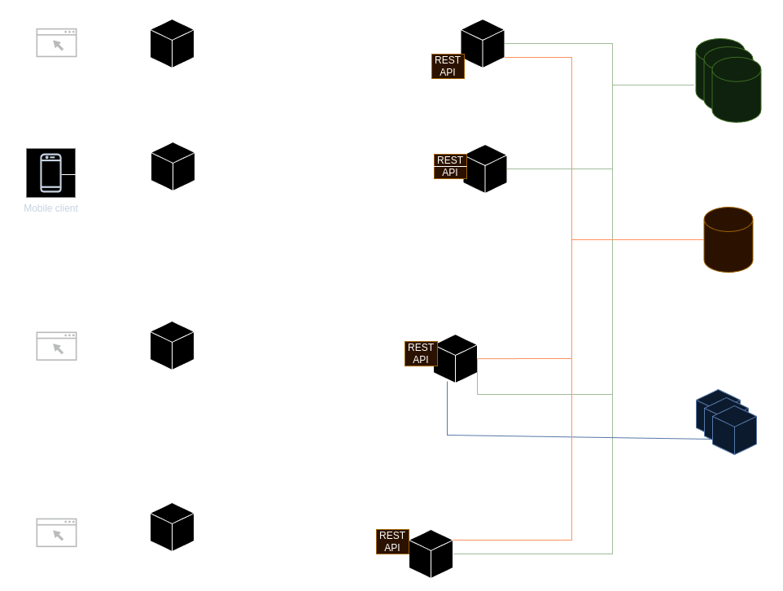
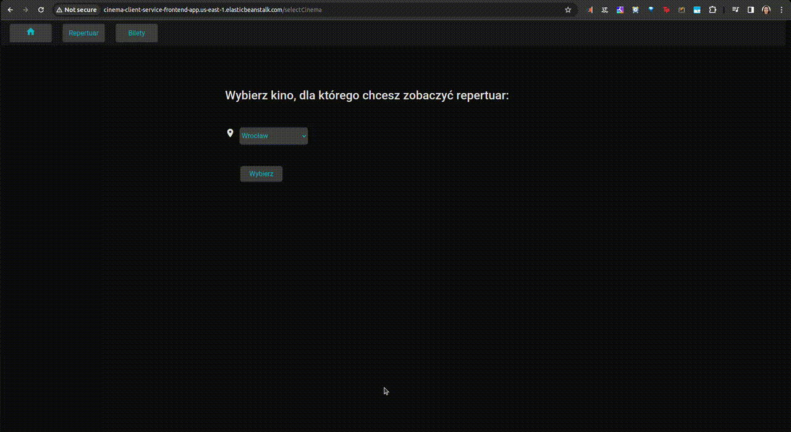
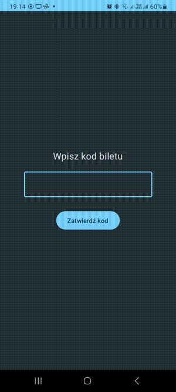

# CinemaPSI
## Overall architecture

## Descriptions of services

| Application                                       | Description                                                                                     |
|---------------------------------------------------|-------------------------------------------------------------------------------------------------|
| [client-service](client-service)                  | Service for browsing repertoires, selecting seats, buying tickets and displaying bought tickets |
| [repertoire](repertoire)                          | Monitor to display repertoires for the nearest future                                           |
| [define-local](define-local)                      | Service for creating new repertoires by local administrator                                     |
| [ticket-collector](ticket-collector)              | Mobile app for collecting tickets                                                               |
| [payment-service](client-service/payment-service) | Mock for external payment service                                                               |

## Deployments
As for time of writing services are deployed in the following locations, however this may change in the nearest future since AWS costs money ;)

| Application                          | Frontend                                                                            | Backend                                                                        |
|--------------------------------------|-------------------------------------------------------------------------------------|--------------------------------------------------------------------------------|
| [client-service](client-service)     | http://cinema-client-service-frontend-app.us-east-1.elasticbeanstalk.com            | http://cinema-client-service-backend-app.us-east-1.elasticbeanstalk.com:8080   |
| [repertoire](repertoire)             | http://repertoire-front-env.eba-3pmiemyr.us-east-1.elasticbeanstalk.com             | http://repertoire-env.eba-he7zfnjb.us-east-1.elasticbeanstalk.com:8080         |
| [define-local](define-local)         | http://cinema-define-local-frontend-env.eba-ppmix8af.us-east-1.elasticbeanstalk.com | http://cinema-define-local-backend-app.us-east-1.elasticbeanstalk.com:8080     |
| [ticket-collector](ticket-collector) | [mobile app](ticket-collector/ticket-collector-app.apk) - for Android               | http://cinema-ticket-collector-backend-app.us-east-1.elasticbeanstalk.com:8080 |

Additionally, for mocking of external payment service the [payment service](client-service/payment-service) 
is deployed in under http://cinema-client-service-payment-service.us-east-1.elasticbeanstalk.com URL.

## Repertoire

## Define-local

## Client-service

## Ticket-collector

---

## Technologie wspierające rozwijanie oprogramowania - treść zadania
W trakcie tego zadania (miniprojektu) zadaniem zespołu jest stworzenie środowiska umożliwiającego ciągłą budowę i wdrażanie przy użyciu aplikacji Jenkins.

### Środowisko budujące
Uruchomić na osobnych instancjach EC2 następujące usługi:
1. Jenkins. Instalacja opisana [tutaj](https://www.jenkins.io/doc/book/installing/).
2. Węzeł budujący (z Dockerem).
3. Serwer repozytoriów Git. Zachęcam do użycia aplikacji [Gogs](https://gogs.io/docs/installation) dostępnej również w postaci kontenera. 
   Alternatywnie można użyć GitHuba lub AWS Code Commit.
4. Lokalny rejestr obrazów Docker. Można wykorzystać gotowy obraz dostępny w witrynie [DockerHub](https://docs.docker.com/registry/). 
   Alternatywnie można użyć witryny DockerHub lub AWS Elastic Container Registry.
   Skonfigurować środowisko w taki sposób, żeby kod wysłany do repozytorium Git poleceniem
   `git push` powodował automatyczne uruchomienie na serwerze Jenkins zadania budującego
   kod i wysyłającego gotowy kontener do rejestru.

### Środowisko uruchomieniowe
Wykorzystać możliwości oferowane przez chmurę AWS do uruchomienia aplikacji:
1. Wykorzystać bazy danych oferowane przez AWS (rozwiązanie preferowane).
2. Udostępnić część statyczną (np. zbudowany front-end, arkusze styli, obrazki) przez usługę S3.
3. Udostępnić część back-end w wybrany przez siebie sposób:
   - używając usługi AWS ElasticBeanstalk
   - używając usługi AWS Elastic Container Service
   - używając usługi AWS Elastic Kubernetes Service
   - używając własnej instancji EC2
